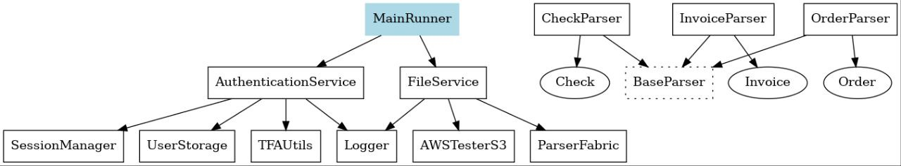
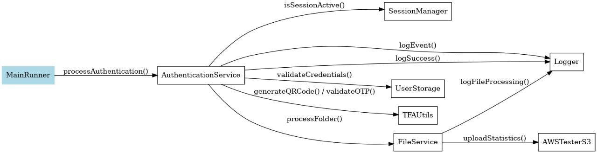

# TeachMeSkills_Final_Assignment

## General Information About the Program

### Code Description:

The program is designed for processing financial documents (invoices, receipts, orders) with the following capabilities:

User Authentication with two-factor authentication (QR codes and one-time passwords).

File Processing including validation, classification, and statistics generation.

Uploading final statistics to Amazon S3.

Logging (error and informational messages).

## Project Structure

### Main Packages and Classes:

#### amazons3:

AWSTesterS3 – class for uploading statistics to Amazon S3 cloud storage.

#### authentication:

TFAUtils – utility class for working with two-factor authentication.

#### constant:

Constants – interface containing constants for settings and paths.

#### exception:

AuthenticationException – exception class for handling authentication errors.

#### fabric:

ParserFabric – factory for creating document parsers.

#### fileparser:

BaseParser and Parser – base classes and interface for file processing.

The documentParser sub-package contains specific parsers: CheckParser, InvoiceParser, OrderParser.

#### logging:

Logger – class for logging program actions.

#### model:

document sub-package contains document models: Check, Invoice, Order.

session sub-package contains the Session class for managing user sessions.

user sub-package contains the User class for representing users.

#### service:

AuthenticationService – service for user authentication.

FileService – service for file processing and statistics generation.

#### session:

SessionManager – class for managing user sessions.

#### storage:

UserStorage – class for storing user information.

#### util:

PropertiesLoader – utility for loading settings from a configuration file.

#### Configuration File:

config.properties – contains settings for Amazon S3 and session duration.

#### Entry Point:

MainRunner – class with the main method for launching authentication and subsequent file processing.

## Instructions for Running

### Project Setup:

Make sure you have Java (JDK 11 or higher) and Maven installed.

Download or clone the project repository.

### Environment Setup:

Install dependencies using Maven:

bash
mvn clean install
Configure the config.properties file in the src/main/resources directory, specifying:

s3.accessKey — AWS access key.
s3.secretKey — AWS secret key.
s3.bucketName — your AWS S3 bucket name.
s3.region — your bucket's region..

### Running the Program:

Run the program with the following command:

bash
java -cp target/your-jar-file.jar main.com.teachmeskills.final_assignment.MainRunner

## Testing Instructions

### Test Scenarios:

est authentication with correct and incorrect login/password combinations.

Scan the QR code and enter the OTP.

Create test files with correct and incorrect names/data.

Place files in directories: checks, orders, invoices, or unauthorized directories.

Verify the correct classification and processing of files.

### Expected Results:

Error logs are saved in logs/error_log.txt.

Informational logs are saved in logs/info_log.txt.

The final statistics file is created in statistics/total_statistics.txt.

Files are uploaded to Amazon S3.

## Diagrams:

### Solution Diagram

### Class Diagram

### Sequence Diagram

