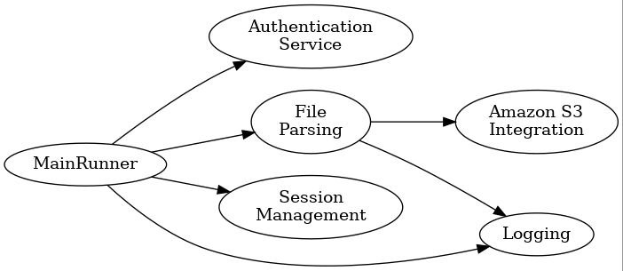
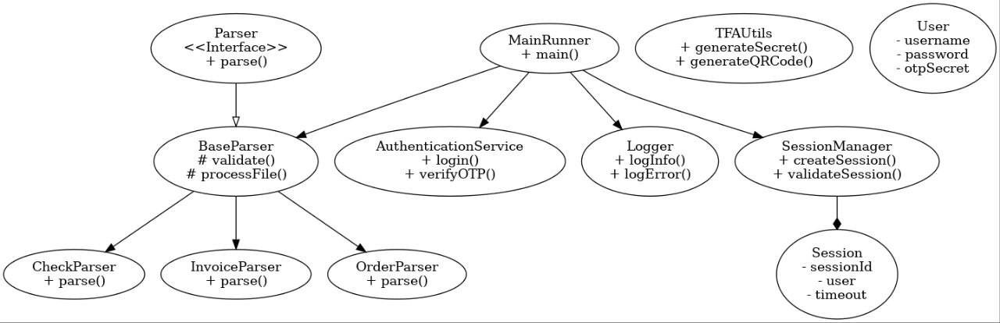
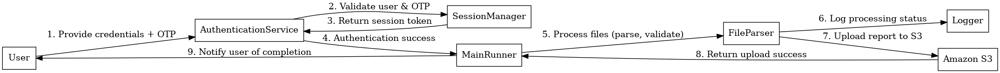

# TeachMeSkills_Final_Assignment

## Общее описание :

Этот проект предназначен для обработки финансовых документов (инвойсов, ордеров и чеков), анализа текстовых файлов, вычисления суммарного оборота и генерации отчетов. Программа поддерживает двухфакторную аутентификацию (TFA) с использованием OTP и QR-кодов и интегрируется с Amazon S3 для загрузки статистики.

## Основные функции:

Авторизация с использованием логина, пароля и OTP.
Обработка текстовых файлов (инвойсы, ордера, чеки).
Генерация статистики по суммарному обороту.
Создание отчетов и загрузка их в облачное хранилище Amazon S3.
Логирование ошибок и информации о процессе работы.

## Структура проекта :

### authentication: Пакет для авторизации и двухфакторной аутентификации.
-AuthenticationService: Сервис для выполнения логина и проверки OTP.

-TFAUtils: Утилитные классы для генерации секретных ключей и QR-кодов.

-User: Класс для представления пользователя.

### constant: Пакет для хранения констант.
-Constants:Класс для хранения всех констант (например, путей к папкам, форматов файлов, строковых шаблонов и т. д.).

### exception: Пакет для пользовательских исключений.
-AuthenticationException: Исключение для обработки ошибок аутентификации.

### fabric: Пакет для создания парсеров через фабрику.
-ParserFabric: Фабрика для создания парсеров в зависимости от типа документа.

### fileparser: Пакет для парсинга финансовых документов.
-Parser: Интерфейс для парсеров.

-BaseParser: Абстрактный класс для базовых операций парсинга.

#### documentParser: Пакет для конкретных парсеров документов.
-CheckParser: Парсер для чеков.

-InvoiceParser: Парсер для инвойсов.

-OrderParser: Парсер для ордеров.

### logging: Пакет для логирования информации и ошибок.
-Logger: Класс для записи логов в файлы.

### model: Пакет с моделями данных для представления документов.
-Check: Класс для представления данных чека.

-Invoice: Класс для представления данных инвойса.

-Order: Класс для представления данных ордера.

### session: Пакет для работы с сессиями пользователей.
-SessionManager: Менеджер сессий для управления активными сессиями.

-Session: Класс для представления сессии пользователя.

-PropertiesLoader: Класс для загрузки конфигурации из файла.

### utils: Утилиты для работы с файлами и папками.
-FileOperation: Класс для обработки файлов, включая их проверку, перемещение и парсинг.

### MainRunner: Главный класс для управления запуском программы, инициирующий процесс авторизации, обработки файлов и генерации отчетов.

### Инструкция по запуску :

#### 1. Клонировать репозиторий:

bash
Копировать код
git clone https://github.com/yourusername/financial-document-processing.git
cd financial-document-processing

#### 2. Установить зависимости:
Используется Maven для управления зависимостями:

bash
Копировать код
mvn install

#### 3. Настроить Amazon S3:
В файле application.properties укажите ключи для доступа к S3:

properties
Копировать код
aws.accessKeyId=your-access-key-id
aws.secretAccessKey=your-secret-access-key
aws.bucketName=your-s3-bucket-name

#### 4. Запуск программы:
Используйте команду:

bash
Копировать код
mvn exec:java

#### 5. Порядок выполнения программы:

-Сканирование QR-кода для получения одноразового пароля (OTP).

-Ввод временного пароля для аутентификации.

-Ввод логина и пароля для окончательной авторизации.

-Ввод пути к папке с документами.

-Программа обработает файлы и создаст отчет, который будет загружен в S3.

## Инструкции по тестированию :

### Авторизация:

-Сканировать QR-код для получения временного пароля.

-Ввести OTP, логин и пароль.

-Проверить, что авторизация проходит успешно.

### Обработка файлов:

-Подготовьте тестовые файлы (инвойсы, ордера, чеки).

-Проверьте, что программа правильно обрабатывает документы и рассчитывает суммарный оборот.

### Работа с S3:

-Убедитесь, что отчет был загружен в S3 после обработки документов.

-Проверьте правильность данных в отчете.

## Важные замечания

-Программа работает только с файлами текущего года.

-Логи сохраняются в отдельные файлы для информации и ошибок.

-Неподдерживаемые файлы перемещаются в папку для некорректных данных.

-Все параметры, такие как ключи для S3 и время жизни сессии, хранятся в application.properties.

## Solution Diagram

## Class Diagram

## Sequence Diagram
